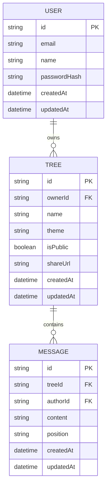

# Technical Design Document: iCard - Festive Tree Messaging Platform

## 1. Overview

iCard is a modern web application that allows users to create and share personalized festive trees with messages. Built with Next.js, Chakra UI v3, and Prisma, it provides an interactive and visually appealing platform for users to express their sentiments through a unique tree-based messaging system.

## 2. Requirements

### 2.1 Functional Requirements

1. **User Authentication & Authorization**
   - Users must be able to sign up and log in securely
   - Users should be able to manage their profile information
   - Users must have proper access control to their trees and messages

2. **Tree Management**
   - Users can create new festive trees with customizable themes
   - Users can edit tree properties (name, theme, visibility)
   - Users can delete their trees
   - Trees should support different visual themes and styles

3. **Message Management**
   - Users can add messages to trees
   - Messages should support rich text formatting
   - Users can edit and delete their own messages
   - Messages should be displayed in a visually appealing way on the tree

4. **Tree Sharing & Collaboration**
   - Users can share trees via unique URLs
   - Support for public and private tree visibility
   - Users can invite others to view or contribute to their trees
   - Real-time updates when messages are added or modified

5. **User Interface**
   - Responsive design that works on all device sizes
   - Dark/light mode support
   - Interactive tree visualization
   - Smooth animations and transitions
   - Accessible design following WCAG guidelines

### 2.2 Non-Functional Requirements

1. **Performance**
   - Page load time < 2 seconds
   - Tree rendering time < 1 second
   - Support for up to 100 messages per tree
   - Real-time updates with < 500ms latency

2. **Security**
   - All user inputs must be sanitized
   - Implement CSRF protection
   - Secure password hashing
   - Rate limiting on API endpoints
   - Input validation on both client and server

3. **Scalability**
   - Support for 10,000+ concurrent users
   - Database optimization for large trees
   - Efficient caching strategy
   - CDN integration for static assets

4. **Reliability**
   - 99.9% uptime
   - Automated backup system
   - Error tracking and monitoring
   - Graceful degradation

## 3. Technical Design

### 3.1 Data Model



### 3.2 API Design

1. **Authentication Endpoints**

   ```typescript
   POST /api/auth/register
   POST /api/auth/login
   POST /api/auth/logout
   GET /api/auth/me
   ```

2. **Tree Endpoints**

   ```typescript
   GET /api/trees
   POST /api/trees
   GET /api/trees/[id]
   PUT /api/trees/[id]
   DELETE /api/trees/[id]
   POST /api/trees/[id]/share
   ```

3. **Message Endpoints**

   ```typescript
   GET /api/trees/[id]/messages
   POST /api/trees/[id]/messages
   PUT /api/trees/[id]/messages/[messageId]
   DELETE /api/trees/[id]/messages/[messageId]
   ```

### 3.3 Frontend Architecture

1. **Component Structure**

   ```
   src/
   ├── components/
   │   ├── auth/
   │   ├── tree/
   │   ├── message/
   │   └── shared/
   ├── hooks/
   ├── lib/
   ├── pages/
   └── styles/
   ```

2. **State Management**
   - React Context for global state
   - React Query for server state
   - Local state for UI components

### 3.4 Security Implementation

1. **Authentication**
   - JWT-based authentication
   - Secure session management
   - Password hashing with bcrypt
   - Rate limiting with Redis

2. **Data Protection**
   - Input sanitization
   - XSS prevention
   - CSRF protection
   - SQL injection prevention

### 3.5 Performance Optimization

1. **Frontend**
   - Image optimization
   - Code splitting
   - Lazy loading
   - Service worker for offline support

2. **Backend**
   - Database indexing
   - Query optimization
   - Caching strategy
   - Load balancing

## 4. Testing Strategy

1. **Unit Tests**
   - Component testing with React Testing Library
   - API endpoint testing
   - Utility function testing

2. **Integration Tests**
   - End-to-end testing with Cypress
   - API integration tests
   - Database integration tests

3. **Performance Tests**
   - Load testing
   - Stress testing
   - Real-time performance monitoring

## 5. Deployment Strategy

1. **Infrastructure**
   - Vercel for frontend deployment
   - PostgreSQL database
   - Redis for caching
   - CDN for static assets

2. **CI/CD Pipeline**
   - Automated testing
   - Code quality checks
   - Automated deployment
   - Environment management

## 6. Monitoring & Maintenance

1. **Monitoring**
   - Error tracking
   - Performance monitoring
   - User analytics
   - Server health checks

2. **Maintenance**
   - Regular security updates
   - Database maintenance
   - Performance optimization
   - Feature updates

## 7. Future Considerations

1. **Scalability**
   - Microservices architecture
   - Container orchestration
   - Database sharding
   - Global CDN deployment

2. **Features**
   - Mobile app development
   - Advanced tree customization
   - Social features
   - Analytics dashboard
